# Evidence gallery

These are viewport screenshots captured during the 2026-08-15 local browser audit. They are intentionally kept in the repository so each finding can be reviewed against the state that produced it.

## Practice and persistence

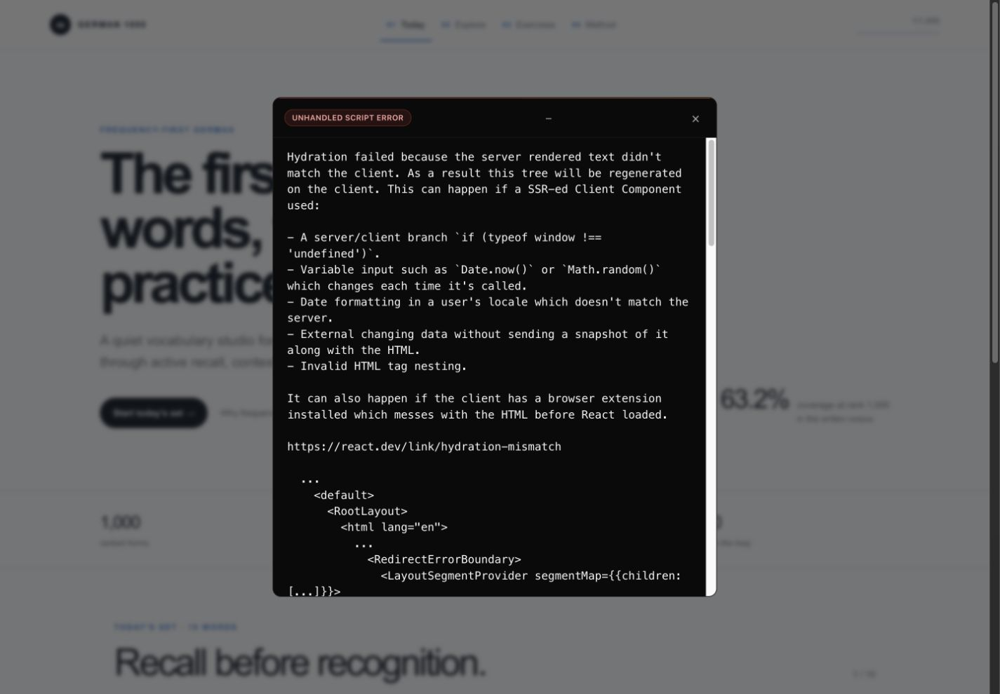

Returning progress triggers a React hydration error in the development session.

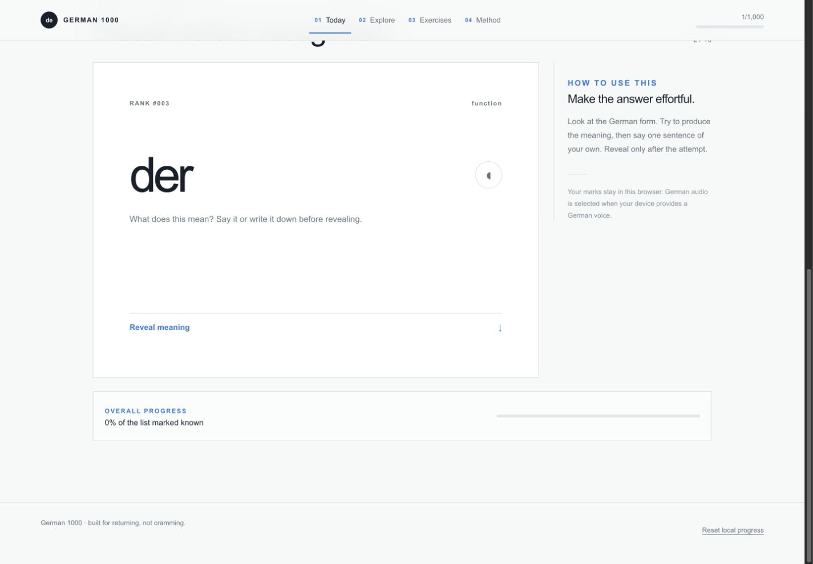

Completing rank `#001` advances to `#003` and leaves conflicting progress indicators.

## Explore

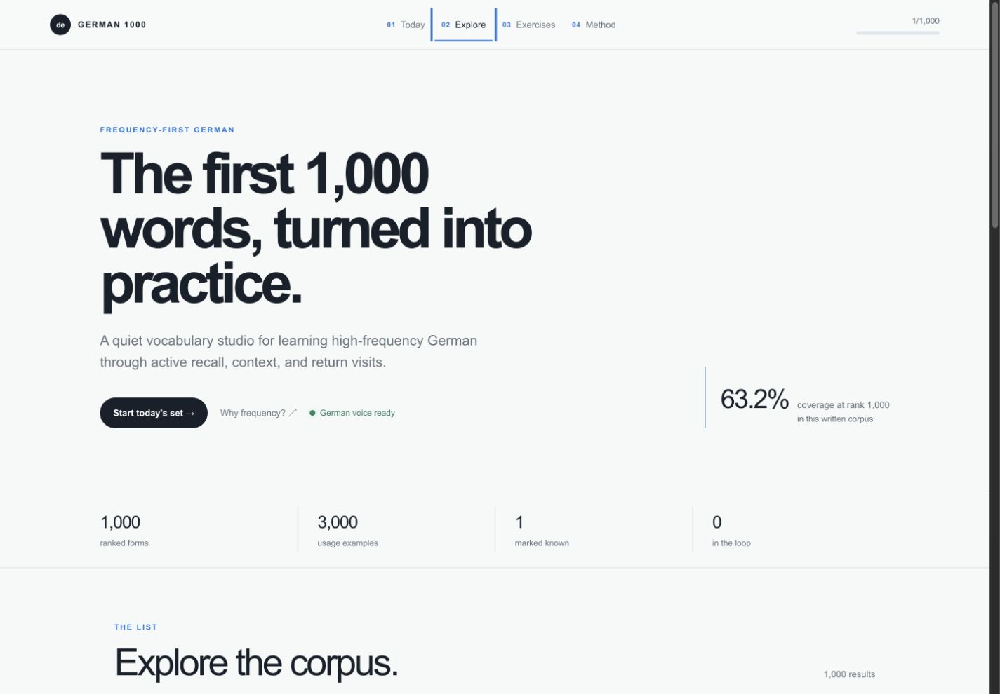

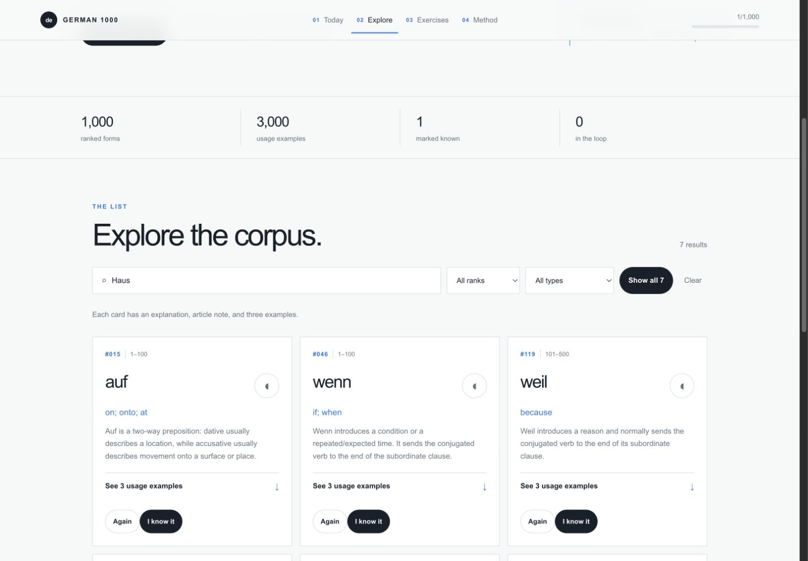

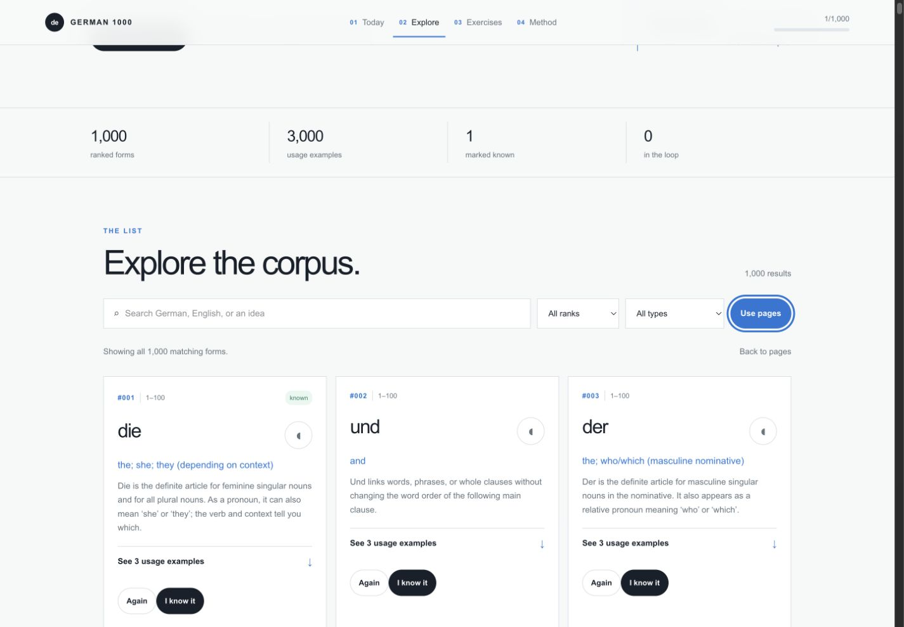

The baseline and search flows are usable; the all-results state is visually long and mounts an unbounded result DOM.

## Exercises and method

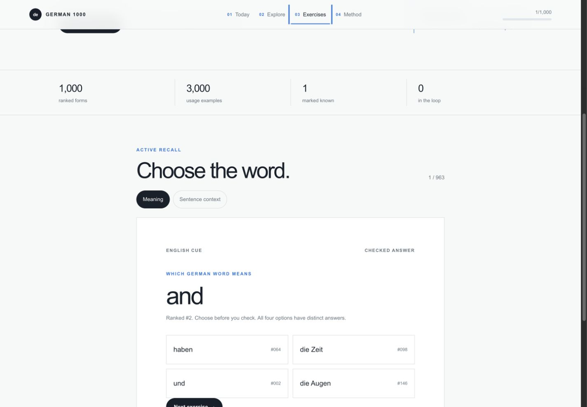

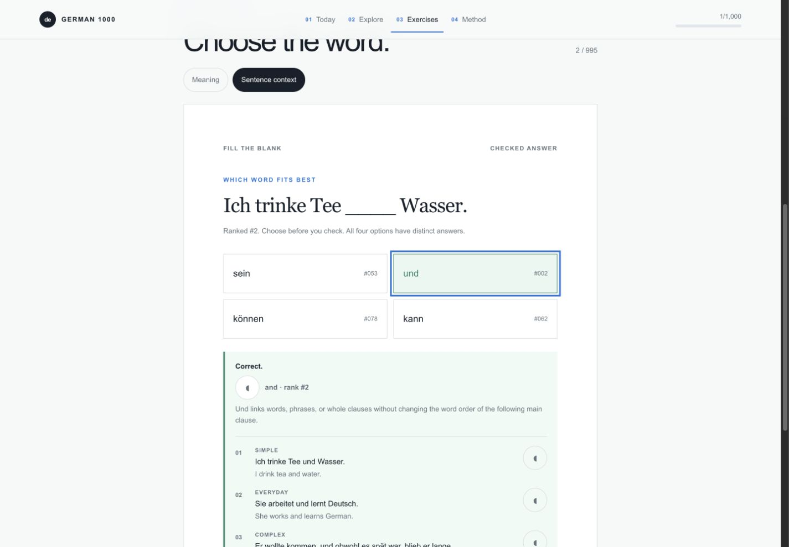

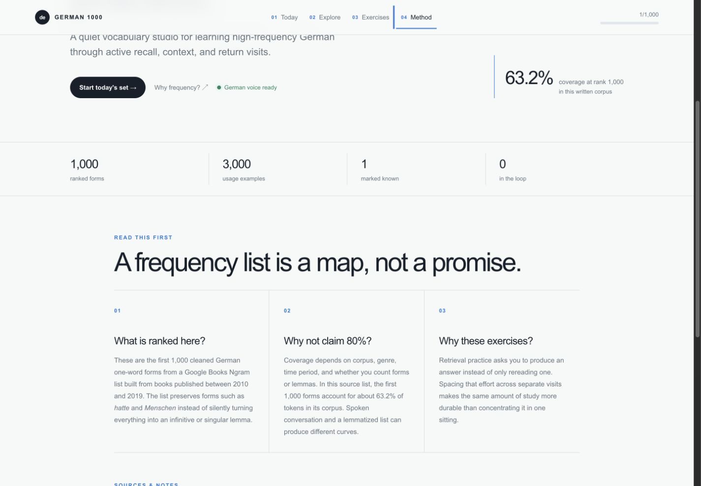

## Responsive states

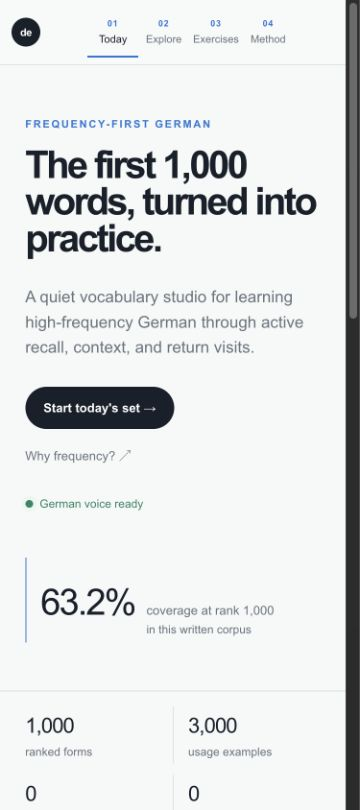

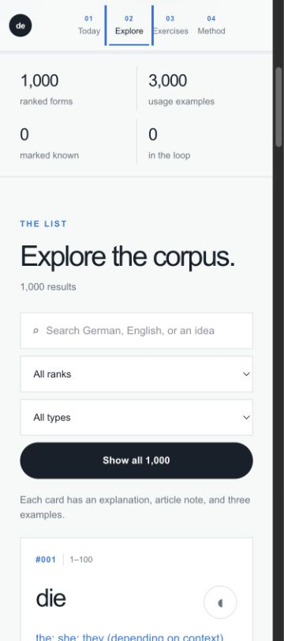

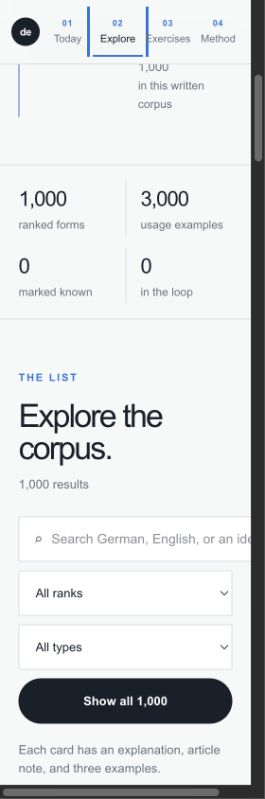

The 375px layouts are coherent; the 280px Explore state clips content and overflows horizontally.
