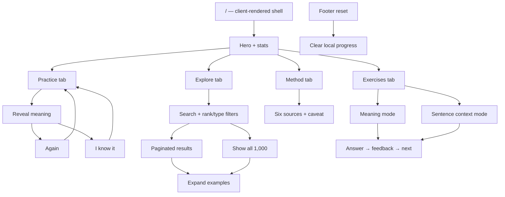
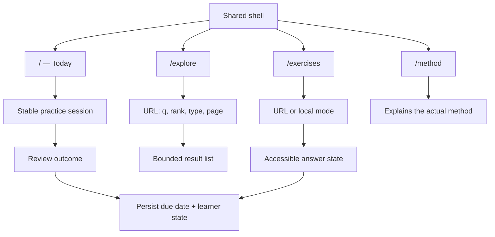

# German 1000 — information architecture and flow map

## Current model

The current product is one client-rendered route with four stateful views. The shared hero, stats, and footer stay in the page while the active content changes.

## Recommended model

The visual language can remain a shared shell, but the tools should become addressable destinations with explicit state.

## Navigation principles

- Use real links for primary destinations.
- Keep the current view in the URL.
- Keep search, filters, and page in the URL if sharing and refresh matter.
- When a view changes, focus a meaningful heading or landmark.
- Keep the Practice landing surface spacious, but give secondary tools a route-level header so the task starts sooner.
