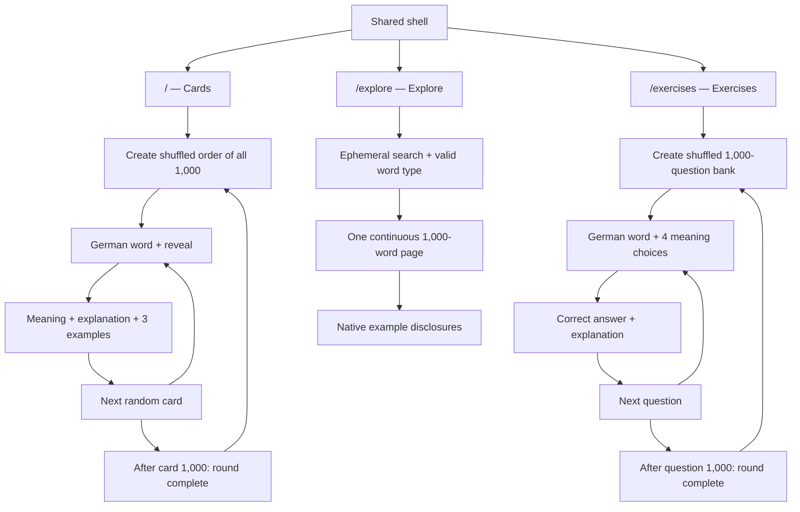

# German 1000 — information architecture and flow map

The product is deliberately small at the route level. A static 1,000-record dataset powers three surfaces; every temporary interaction stays in memory and disappears on reload.

## Navigation principles

- Use real links for the three public destinations and preserve the current location in the URL.
- Keep only search and word-type filters shareable on Explore; they are convenience state, not learner state.
- Treat reload as a clean start for Cards and Exercises. No cookies, local storage, IndexedDB, server session, or database write is part of the product contract.
- Put the German word before its explanation so the user can recall first and verify second.
- Keep the 1,000-word index genuinely scrollable instead of dividing it into pages or replacing it with a virtualized window.
- At the end of either deck, say exactly what happened and provide one clear shuffle action.
